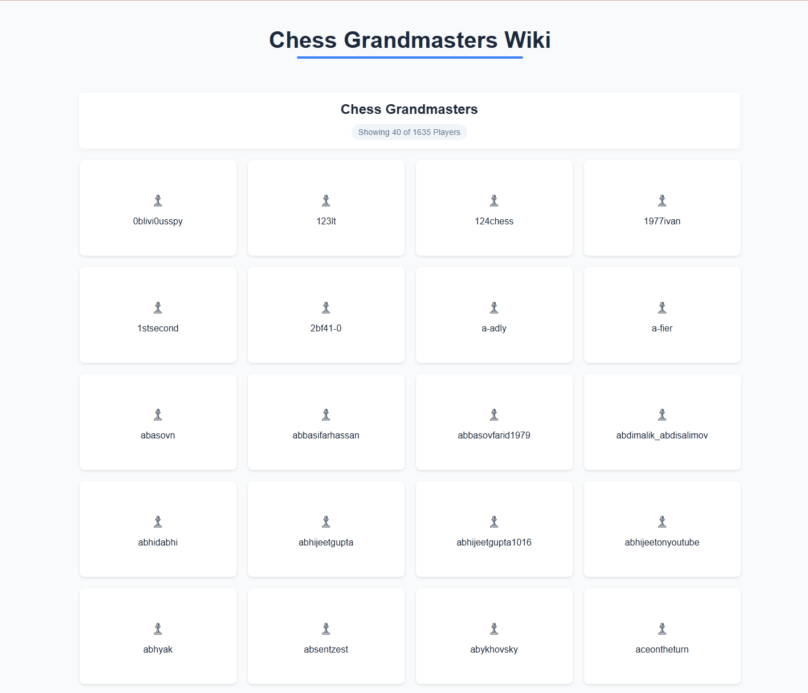
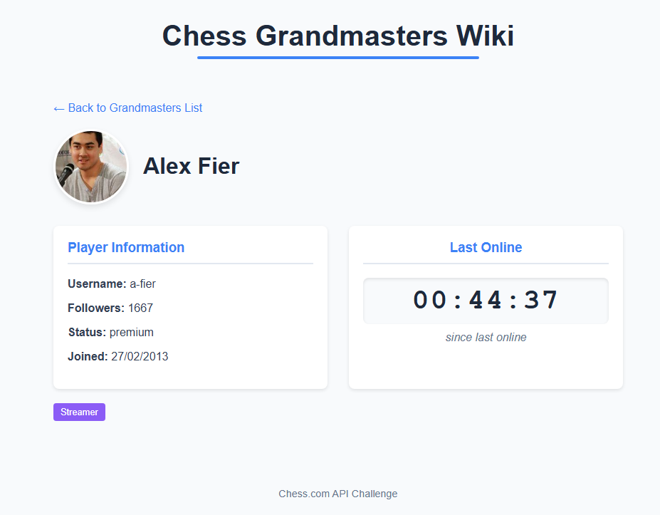

# Chess.com Grandmasters Explorer

A React application that displays chess grandmasters from the Chess.com API with an infinite scrolling interface and detailed player profiles.

## Features

- Displays a list of chess grandmasters from Chess.com API
- Infinite scroll functionality for browsing a large list of players
- Responsive grid layout that works on all device sizes
- Player detail pages showing individual player information 
- Loading states and error handling for a robust user experience
- Comprehensive test suite with Jest and React Testing Library

## Screenshots




## Technologies Used

- React 19 with TypeScript
- React Router for navigation
- Vite for bundling
- Custom infinite scroll implementation
- Jest and React Testing Library for tests
- CSS for styling (no external UI libraries)

## Getting Started

### Prerequisites

- Node.js (v14 or newer)
- yarn (npm install yarn -g)

### Installation

1. Clone the repository:
```bash
git clone https://github.com/yourusername/amenitiz-fe-tech-challenge.git
cd amenitiz-fe-tech-challenge
```

2. Install dependencies:
```bash
yarn
```

3. Run the development server:
```bash
yarn run dev
```

4. Open http://localhost:5173 to view it in your browser

### Running Tests
Run the test suite with:

```bash
yarn run test
```

### Project Structure
```
src/
├── api/          # API service and utilities
├── components/   # Reusable components
├── pages/        # Page components
├── model/        # TS Interfaces
├── utils/        # General Utilities
```

### Implementation Decisions & Compromises

During development, I made several implementation decisions to balance performance, user experience, and time constraints:

#### API Integration:

- Direct integration with Chess.com API without a backend proxy
- No API caching implemented to keep the solution simple
- Limited error handling to basic user messages

#### Infinite Scroll:

- Used a custom infinite scroll implementation with Intersection Observer API
- Pre-fetched all player usernames at once rather than implementing pagination with the API
- This approach works well for the limited dataset but wouldn't scale to millions of records

#### Component Structure:

- Created reusable components where possible
- Kept state management simple using React hooks without additional libraries

#### Styling:

- Used plain CSS for styling to demonstrate CSS skills
- No CSS-in-JS or UI libraries to keep the bundle size small
- Limited responsive design to basic breakpoints

#### Testing:

- Focused on component and integration tests rather than end-to-end tests
- Mocked API calls rather than testing against the real API


### Production Readiness Checklist
To make this application production-ready, the following enhancements would be necessary:

#### Performance Improvements
- [ ] Implement proper API pagination to load only necessary data
- [ ] Add caching layer for API responses (using React Query, SWR, or custom cache)
- [ ] Code splitting with React.lazy() for route-based component loading
- [ ] Optimize bundle size with tree shaking and dependency optimization
- [ ] Implement service workers for offline capabilities and caching
- [ ] Add proper memory management for the infinite scroll (virtualization)

#### UI/UX Enhancements
- [ ] Add loading skeletons instead of simple loading text
- [ ] Implement proper animations for page transitions and loading states
- [ ] Enhanced error states with retry functionality
- [ ] Advanced filtering and search capabilities for players
- [ ] Improve responsive design for various device types and orientations
- [ ] Add dark mode support

#### Architecture & Code Quality
- [ ] Implement state management solution for larger application scale (Redux, Zustand, or Context)
- [ ] Add stronger typing with more specific TypeScript interfaces
- [ ] Extract business logic into custom hooks for better separation of concerns
- [ ] Implement React Error Boundaries for graceful error recovery
- [ ] Create a component library with Storybook for better documentation

#### Testing & Quality Assurance
- [ ] Increase test coverage with more edge cases
- [ ] Add end-to-end tests with Cypress or Playwright
- [ ] Implement visual regression testing
- [ ] Add accessibility (a11y) testing
- [ ] Performance testing and monitoring

#### Deployment & DevOps
- [ ] Set up proper CI/CD pipeline
- [ ] Configure environment-specific variables
- [ ] Add monitoring and error tracking (e.g., Sentry)
- [ ] Implement feature flags for controlled rollouts
- [ ] Configure proper caching headers and CDN distribution

#### Security
- [ ] Add rate limiting for API requests
- [ ] Implement CORS properly if creating a backend proxy
- [ ] Add security headers
- [ ] Perform dependency vulnerability scanning
- [ ] Add protection against common web vulnerabilities

#### Accessibility
- [ ] Ensure proper keyboard navigation
- [ ] Add ARIA attributes where necessary
- [ ] Ensure proper color contrast
- [ ] Test with screen readers
- [ ] Add focus management for modals and dynamic content


### Key Learnings & Challenges
During the development of this application, I encountered several challenges:

- API Limitations: The Chess.com API doesn't provide pagination for the list of titled players, which required creative solutions for handling large datasets on the client side.
- Performance Optimization: Implementing an efficient infinite scrolling solution that doesn't overload the DOM was challenging but rewarding.
- Testing Complexity: Setting up proper mocks for API calls and handling asynchronous tests required careful consideration.
